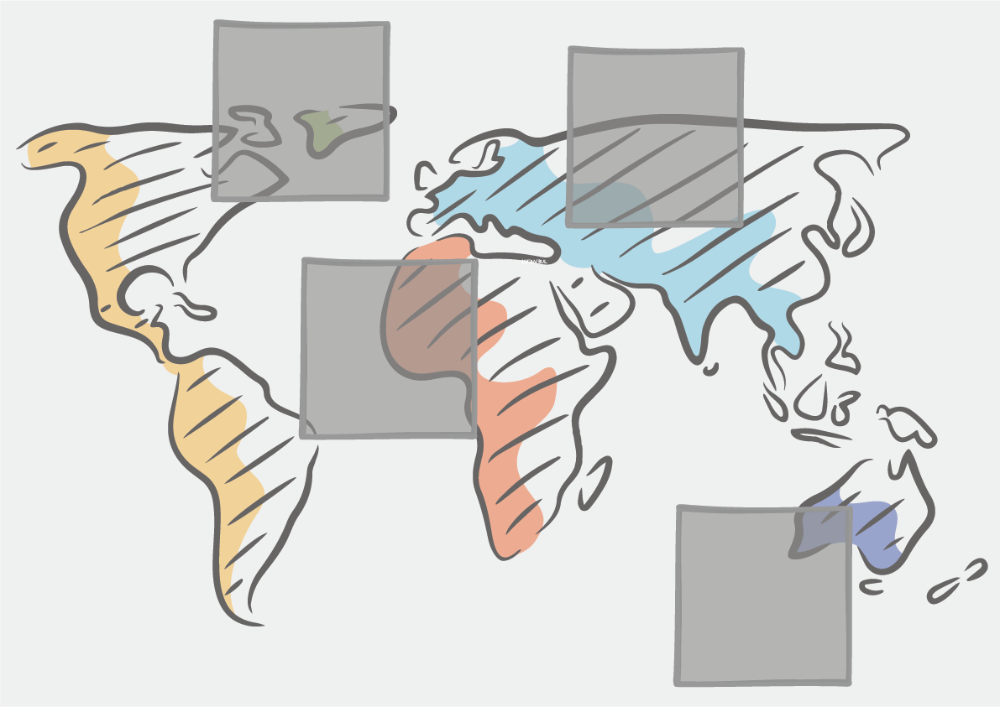
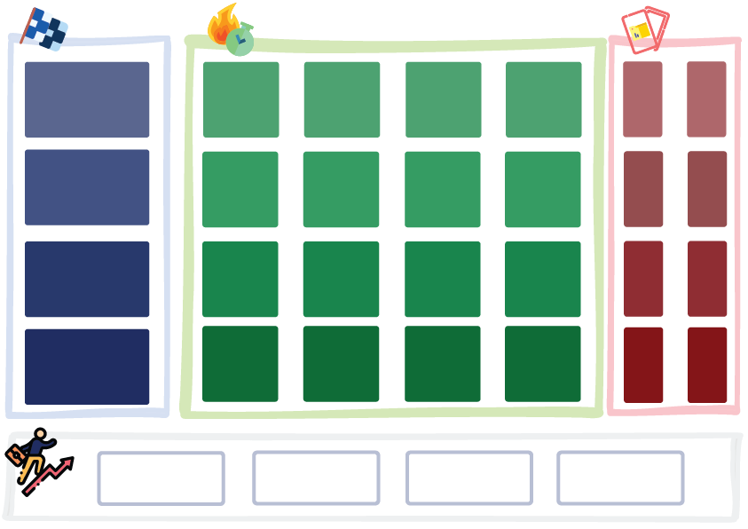
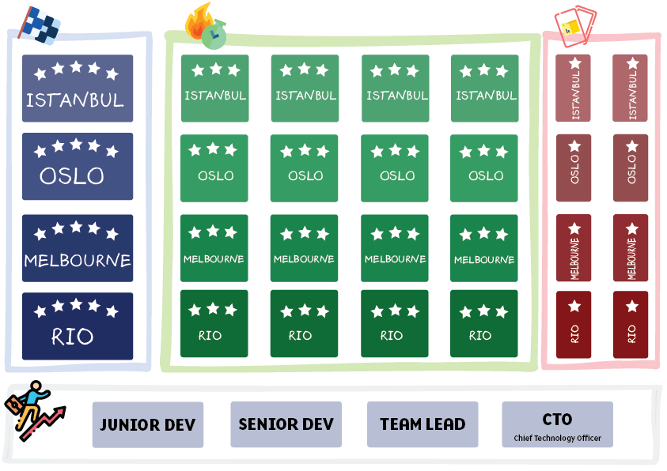

# Curricular Resources

You can first check our tutorial activities at [Google Docs](https://docs.google.com/document/d/1TDy4qF3XRSMCRclN_lYfUjaXCQnZckIahcXcz8iS4cY/edit?usp=sharing)

# Gamification Ideas

We developed game assets to help teachers adapt the curricular material. In this game, each student is the leader of their international data science team. They visit various locations to solve different challenges and explore opportunities.

You can play the game with a group of 4-6 students, or ask each student to complete individually. You don’t actually need any electronic device to complete the activities. But, if you want to see the end results such as tables and visualizations, you can use your tablet or computer to use our data interpretation platform "Marti".

You can add following flavours to increase the excitement:

- **Budget and Profit:** Every problem requires some budget to start. If you do not have enough budget to solve any problem, you are out of the game. Profit is what you will earn at the end of solving the problem.

- **Required Time:** You need to solve this problem in a given time if you do not solve the problem in the estimated time, your profit will decrease by 10%.

- **Team capacity:** Teams have different capacities. Some teams are better at some operations. If you have enough budget, you can transfer new team members from the recruitment center.

- **Recruitment Center:**
  * Mathematician: Unlocks mathematical cases.
  * Statistics and ML Developer: Unlocks the big data operations.
  * Software Engineer: Unlocks the building software duties.
  * Visual Designer: Unlocks the designing of graphical data charts.

<u>NOTE:</u> Maybe you don't even need gamification in classroom. Data science is real fun as students become familiar with the concepts and can really solve the problems with real life datasets. Increasing the challenge slowly and let them explore the real life problems is enough to excite students!

## Game Board and Collecting Badges in Mini Boards
You can create a board-game like structure using the board and tokens in the [Board Resources Folder](media/board). You can use the main game board, which is simply a world map with pre-occupied card location, to place the mission cards.

Each player also has a separate mini-board to collect their badges.

After completing each row, they will earn new skills to consecutively become junior dev, senior dev, team lead and CTO.

## Mission Cards

Linked with SDGs, each mission includes eight data analysis cards and two visualization cards. Download the cards from [Mission Cards Folder](./media/mission/)

**Istanbul**

Each mission is linked a city. For example, "Transportation" related tasks take place in Istanbul, where several citizens struggle in traffic, public and private transportation every day.
Istanbul is the most populous city in Turkey and the country's economic, cultural and historic center. The population is still growing and approximately 18 million people live in Istanbul.
Railway transportation is one of the most important investment areas in crowded cities as it handles large numbers of people with ease, it is environmentally friendly, and it reduces the traffic.

_Source:_
- https://data.ibb.gov.tr/dataset/rayli-sistemler-maksimum-yolculuk-sayisi/resource/81fa122e-49c1-4191-aac9-a38becd0c359

**Oslo**
Oslo promotes city bike usage as it helps to reduce carbon emissions. They provide bikes alongside the city. We simplified the following dataset to help students how city planners place bike stations to increase the use of these bikes.

_Source:_ 
- https://oslobysykkel.no/en/open-data
- https://medium.com/@jonolave/exploring-open-data-from-oslo-city-bike-67985a101268

## Visualization Cards

Visualization cards lists key properties and helpful hints for each chart type and chart elements. Download and use them at [Chart Cards Folder](./media/chart)

## Data Fallacies Cards (WiP)

Nine data fallacies and three interesting examples for each fallacy.

## Data Studio Versions

Teachers can use the interactive Data Studio pages to explore and explain our datasets.

- **Football Players:** https://datastudio.google.com/s/pgBlwHYOdiY