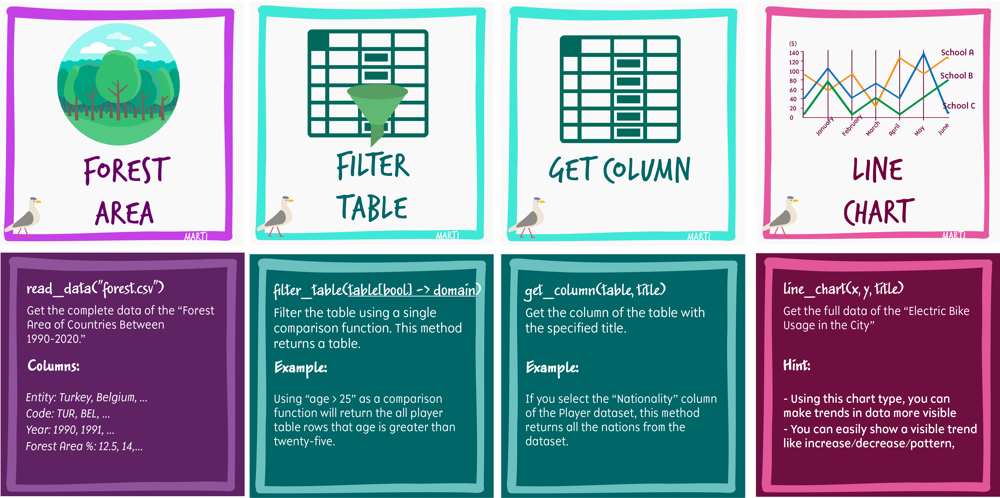

## A Step for an Inclusive Data Programming Environment

[[TR]](https://karton-project.github.io/marti/index.html), [[EN]](https://karton-project.github.io/marti/index.html#en)

Data literacy has become a fundamental skill for K12-students to acquire. Today, we need to understand data to grasp global events and take decisions accordingly. Therefore, the research on teaching data literacy in the early years of education gains more interest. Yet, current applications to teach about data in K-12 classrooms gained a limited audience due to lacking available curricular activities and requiring desktop interfaces that limit the affordability. To address these challenges, we designed a set of tools for supporting different learning styles and increasing affordability.

- We have developed two interfaces for two different cases:
    1. [Web interface with drag and drop programming blocks](https://karton-project.github.io/marti/index.html#en)
    2. [Mobile interface with tangible paper blocks](https://karton-project.github.io/marti/mobile.html) 

The web interface is designed for an easy and fast manipulation of data. You can manipulate data with basic math operations, visualize it, gather data from csv files, represent data on geographic maps or use pictures as your data.

 
 You can use your mobile phone with the helper card blocks. You can print these cards using [Data Programming Cards - Google Slides](https://docs.google.com/presentation/d/1BFM48sA1IQlBnmjADtulfzn37pymWqVCsiU1TjCVDBA/edit?usp=sharing ). If you use the "Print on Both Sides" >> "Flip on Long Edge" setting, the cards front face and explanations will be printed properly. The cards help students to grasp the data concepts one command at a time. You can create card-based unplugged activities. Or, scan these cards with Marti mobile web app and create your data pipelines using your smartphone.

------
Find our all curricular resources at [CURRICULUM](CURRICULUM.md)

______

## Learning Goal
We aim to increase students' ability to interpret a wide variety of data and use them to solve sustainability issues.

Marti is not only a web/mobile data programming environment. We also created a gamified curriculum with board game like elements to achieve active and meaningful learning. Research stresses that children need to be actively engaged with the learning content to comprehend the new information. Additionally,  in the current pandemic, establishing a way to simulate the classroom environment at home becomes a significant research area. 

## Attention to Equity

**Affordable Unplugged Activities:** Designing unplugged activities allow students and teachers to complete algorithmic activities without a digital device. This approach increases the affordability of programming education. Similarly, our board game like activities support problem-solving without computers or mobile phones.

**Inclusiveness through Materiality:** Using tangibles can significantly increase the interface’s accessibility to students with mixed visual abilities.

**Awareness of Current Issues:**  Most of the decisions in today’s world depend on data. Every second, billions devices produce trillions of data. Data is power. Every day, analyzing, interpreting, and communicating data becomes more critical. Interpreting the data in a meaningful way can help us solve many problems such as climate change, current pandemic, or sustainable food production.

## Other Available Affordable Data Programming Resources

_See the other available resources in our curated [RESOURCES](./RESOURCES.md) list. I listed my three favorite **free** resources/tools here:

* [Orange](https://orange.biolab.si/workflows/page/2/) provides an easy to manipulate graphical interface. It is open source and available in open-distributions. You can use Orange in RasPi.
* [Data Therapy](https://datatherapy.org/activities/) provides excellent activities that combines storytelling and data. Their [Data Studio 2016](https://datastudio2016.datatherapy.org/2016/03/14/368/) workshop also lists several activities and small real-life data.
* [Data Basic](https://databasic.io/en/culture/build-a-sculpture) As part of the Data Culture project, Data Basic both provides interactive tools and unplugged activities. [Data Sculptures](https://civic.mit.edu/2019/09/05/thoughts-on-designing-data-sculptures/) explains designing data sculptures.

## TODOs:

- [ ] Level-mode tutorials for students
- [ ] Save program state to JSON. (in-progress)
- [ ] Mobile use tutorial
- [x] Few-shot card training scripts for TFJS and CoreML
- [x] Refactor variable and function definitions
- [x] Leaflet Update to solve the CORS Policy Error