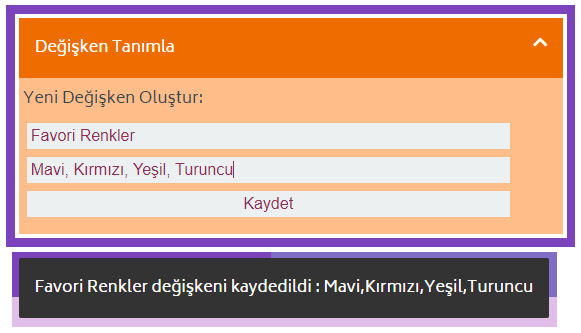
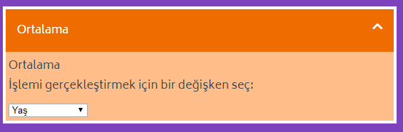
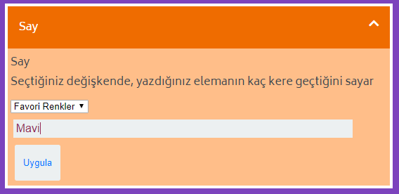
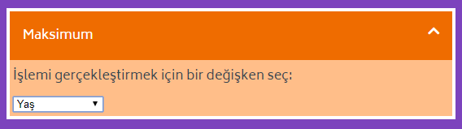
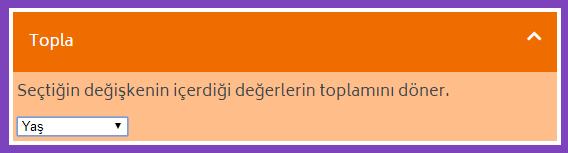
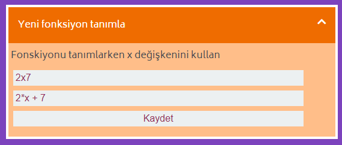
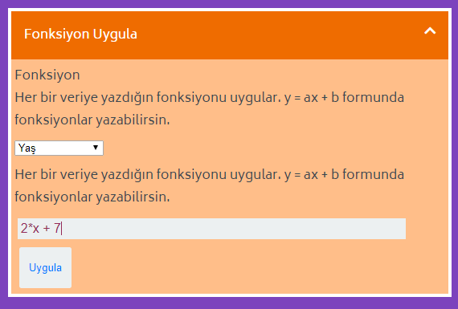
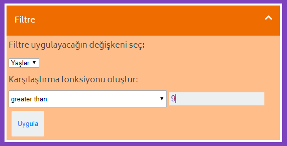

==================================================
Genel Bloklar
==================================================

Genel Bloklar, bir veri setini incelerken kullanacağımız en temel operasyonları içerir.

Tüm Genel Blokların listesi:
============================
1. `Değişken Tanımla`_
2. `Ortalama`_
3. `Say`_
4. `Maksimum`_
5. `Minimum`_
6. `Topla`_
7. `Yeni Fonksiyon Tanımla`_
8. `Fonksiyon Uygula`_
9. `Filtre`_

Değişken Tanımla
================

Değişken tanımlamaya veya tanımladığınız bir değişkenin değerini değiştirmeye yarar. Değişken tanımlarken iki girdi bekler: *İsim* ve *Değer*.

Değişkeninize istediğiniz ismi verebilirsiniz. Verdiğiniz isimdeki boşluk, virgül, nokta gibi alfanumerik olmayan değerleri otomatik olarak silecektir.

Değer olarak numara, yazı veya liste alır. Liste yaratmak istediğinizde, girdiğiniz verileri virgülle ayırarak yazmanız gerekmektedir.

Örnek değişkenler:

**İsim**: Favori Renk, **Değer**: Mavi

**İsim**: Favori Renkler, **Değer**: Mavi, Kırmızı, Yeşil

Değeri tanımladıktan sonra, altta değişkenin kaydedildiğini, değiştirildiğini veya bir sebepten dolayı kaydedilemediğini söyleyen bir onay ekranı çıkar.

Ortalama
========

Tanımladığınız değişkenin ortalamasını alır. 

Önceden belirlediğiniz değişkenleri listeden seçip, ortalama alabilirsiniz. 

Ortalamayı aldıktan sonra çıktı ekranında sonucu görüntüler. Bu sonucu kaydetmek isterseniz Kaydet butonunun üzerine gelerek,kaydetme alanını açabilirsiniz.

Say
====

Tanımladığınız değişkeninde bir elemanın veya tüm elemanların ne kadar tekrar ettiğinin sonucunu verir. 

Önceden belirlediğiniz değişkenleri listeden seçtikten sonra eğer eleman alanını boş bırakırsanız tüm elemanların kay kez tekrar ettiğini döner.

Eğer eleman listedeyse kaç kere tekrar ettiğini, eğer listede yoksa 0 döner.

Bu sonucu kaydetmek isterseniz Kaydet butonunun üzerine gelerek,kaydetme alanını açabilirsiniz.

Maksimum
========

Tanımladığımız değişkenin sahip olduğu en yüksek değeri döner. 

Eğer seçtiğimiz değişken numerik ise en yüksek numarayı, eğer yazılardan oluşuyorsa alfabetik sıraya göre en sondaki değeri döner.

Minimum
========

Tanımladığımız değişkenin sahip olduğu en düşük değeri döner. 

Eğer seçtiğimiz değişken numerik ise en düşük numarayı, eğer yazılardan oluşuyorsa alfabetik sıraya göre en baştaki değeri döner.

Topla
========

Tanımladığımız değişkenin sahip olduğu tüm numerik değerlerin toplamını döner.

Yeni Fonksiyon Tanımla
=======================

Tek değişkenli bir fonksiyon tanımlar. Tüm matematiksel operasyonlar açıkça belirtilmelidir. Örneğin:

``2x + 7`` fonksiyonu ``2*x + 7`` olarak yazılmalıdır. Yoksa operasyon ``2x`` adında bir değişken arayacaktır.

Fonksiyon Uygula
=================

Tek değişkenli tanımladığınız fonksiyonu, seçtiğiniz değişkene uygular. Tüm matematiksel operasyonlar açıkça belirtilmelidir. Örneğin:

``2x + 7`` fonksiyonu ``2*x + 7`` olarak yazılmalıdır. Yoksa operasyon 2x adında bir değişken arayacaktır.

Filtre
========

Filtre operasyonu üç girdi bekler.

1. Filtre işlemini uygulayacağınız değişkeni seçmelisiniz.
2. Büyüktür veya küçüktür gibi bir karşılaştırma işlemi seçmelisiniz.
3. Bu karşılaştırma işlemi için bir sayı veya yazı girmelisiniz.

Örneğin, ``Renkler = "Mavi", "Kırmızı", "Turuncu", "Yeşil"`` verisi için ``"Mor"`` değerinden büyük olanları filtrelemek istiyorsak:

1. Renkler
2. Büyüktür
3. Mor

filtresi ``"Turuncu" ve "Yeşil"`` değerlerini dönecektir. Çünkü alfabetik olarak Turuncu ve Yeşil, Mor'dan büyüktür.

