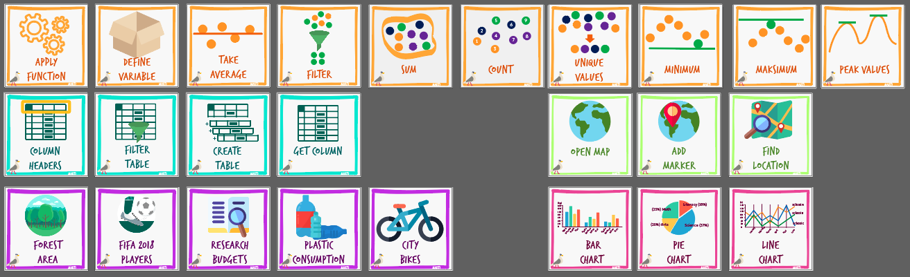
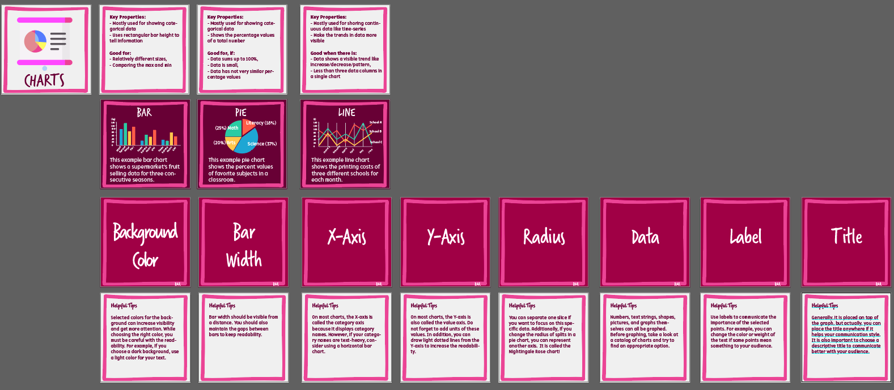

# CURRICULAR MATERIALS

## Marti Command Cards

You can use command cards in unplugged activities. All cards are available at the [CARDS FOLDER](./cards-en)

## Chart Cards

You can use chart cards to help students remember key components and visualization tricks. [CHARTS FOLDER](./chart)

